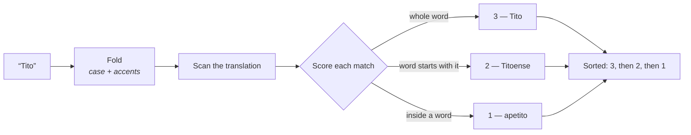

# 📖 Scriptura

> **Open Bible data ecosystem — multi-translation, multi-language, developer-first.**

[](LICENSE)
[](#verified-translations)
[](#verified-translations)
[](docs/contributing.md)
[](#verified-translations)

Scriptura is a free, open-source monorepo for working with Bible data programmatically. It provides structured, machine-readable scripture across multiple translations and languages — all under verified public-domain or open-source licenses — alongside TypeScript tooling for search, comparison, validation, and API generation.

**The mission is simple: no developer should hit a paywall, a DMCA notice, or a legal grey area when building with the Bible.**

**Try the reader:** <https://alanroman117.github.io/Scriptura/>. It is a preview, published for the people reviewing its Spanish, French and Japanese text; what changed is in [`CHANGELOG.md`](CHANGELOG.md).

---

## ✨ Features

- 📚 **Multi-translation** — 11 verified translations, all ingested
- 🌍 **Multi-language** — Bibles in English, Spanish, French and Japanese, and a reader whose interface speaks all four
- 🔍 **Search** — ranked full-text and reference-based lookup via `@scriptura/search`, with optional whole-word and case matching
- ⚖️ **Compare** — side-by-side multi-translation diff via `@scriptura/compare`
- 🛡️ **Validated** — every translation carries verified license metadata, checked by `scripts/validate.py`
- 🔌 **API-ready** — framework-agnostic REST handlers in `@scriptura/api`; run it locally with one command (GraphQL is planned — see [Project status](#-project-status))
- 🧩 **Modular** — install only what you need (`@scriptura/core`, `/search`, `/api`, etc.)
- 📖 **Study Bible foundation** — comparison engine built to support future annotation and cross-reference layers

---

## 📦 Packages

| Package | Description |
|---|---|
| `@scriptura/core` | Loader, parser, canonical TypeScript types |
| `@scriptura/search` | Full-text search + reference lookup (e.g. `"John 3:16"`) |
| `@scriptura/compare` | Multi-translation verse/chapter diff engine |
| `@scriptura/validate` | Data integrity checker for translation directories |
| `@scriptura/api` | REST handlers (drop into any Node server or edge runtime); GraphQL planned |

---

## 🚀 Quick start

**Platforms:** Linux and macOS (Apple Silicon or Intel). Both are covered by CI.

**Prerequisites:**

| | |
|---|---|
| Node 24 | pinned in [`.nvmrc`](.nvmrc); any `.nvmrc`-aware manager works — `nvm use`, `fnm use`, or `mise install` (mise reads `.nvmrc` once `idiomatic_version_file_enable_tools` includes `node`) |
| Python 3.9+ | for the data tooling, invoked as `python3`. Standard library only — there is nothing to `pip install` |
| `unzip` | for the export round-trip test. Ships with both Linux and macOS |
| Chromium | only for the reader tests: `npx playwright install chromium` |

```bash
# Clone the repo
git clone https://github.com/AlanRoman117/scriptura.git
cd scriptura

# Install all workspace dependencies
npm install

# Compile the packages. Do not skip this: `npm install` does not build them,
# and the compiled output is not in the repo.
npm run build

# Validate all translation data
npm run validate

# Run the tests
npm test

# Start the REST API on :3000, with hot reload
npm run dev:api

# …or the reader PWA on :5173
npm run dev:reader
```

**Why the build step is not optional.** Each package publishes its modules from
`dist/`, which is generated and gitignored. Until it exists, `@scriptura/core/books`
and its sibling subpaths resolve to files that are not there, and both of these
fail on a fresh clone:

```
✘ [ERROR] Could not resolve "@scriptura/core/books"        # npm test
Error [ERR_MODULE_NOT_FOUND]: Cannot find module …/dist/books.js   # npm run dev:api
```

`npm run build` fixes both. If a later build looks like it did nothing — no
`dist/`, yet nothing is compiled — its incremental cache is stale, and
`npm run build -- --force` clears it.

### Every script

They all live in [`package.json`](package.json); this is what each one is for.
[`CLAUDE.md`](CLAUDE.md) explains the reasoning behind the ones with surprises
in them.

| Script | What it does |
|---|---|
| `npm run build` | Compiles every package to `dist/` with `tsc --build`. Run it after `npm install` and after pulling changes |
| `npm run lint` | The type-check. It is the same `tsc --build`: TypeScript rejects `--noEmit` on composite project references, so the emitted declarations are a byproduct of checking |
| `npm test` | The jest suite: everything provable in-process, including the parity check between the dynamic and static serving paths |
| `npm run test:contract` | The HTTP contract tests, over a real socket. Playwright in API mode, so no browser is downloaded |
| `npm run test:reader` | The reader PWA in Chromium: desktop, an emulated phone, and the dev server. Needs `npx playwright install chromium` |
| `npm run validate` | Checks every translation in `data/` against the canon. Add `-- --strict` to fail on warnings too |
| `npm run check:canon` | Verifies the three canon definitions still agree with each other and with the data |
| `npm run dev:api` | The REST API on :3000 with hot reload, through `tsx` |
| `npm run start:api` | Builds, then runs the compiled API on :3000 |
| `npm run build:api` | Compiles `data/` into a static JSON tree under `dist/`, one file per endpoint, for S3 or any static host |
| `npm run dev:reader` | The reader PWA's dev server on :5173 |
| `npm run build:reader` | A production build of the reader |
| `npm run build:site` | The publishable site in `site/`: the reader plus the translation files it downloads. `-- --base /Scriptura/` builds it for a path, as GitHub Pages serves it; `-- --preview` marks it for translation reviewers |
| `npm run test:site` | Builds the preview site for `/Scriptura/` and tests it the way Pages serves it: from files alone, under the path. `SITE_URL=… npx playwright test --project=site` (with `SCRIPTURA_SITE_ONLY=1`) runs the same checks against the live site |
| `npm run review:screens` | Screenshots of every reader screen in every interface language, desktop and phone, into `review-screenshots/` for translation reviewers. Not a test |
| `npm run schema:gen` | Regenerates the JSON schemas under `data/schemas/` from the canonical types |

The data tooling is Python, standard library only, and is invoked directly:
`python3 scripts/ingest.py --list`, `python3 scripts/validate.py --strict`,
`python3 scripts/check-canon-sync.py`.

### Load a verse in Node

```typescript
import { loadTranslation } from '@scriptura/core';

const bible = await loadTranslation('kjv');
const verse = bible.verse('John', 3, 16);

console.log(verse.text);
// "For God so loved the world, that he gave his only begotten Son..."
```

### Search across a translation

```typescript
import { search } from '@scriptura/search';

const results = await search('rv1909', 'amor eterno');
results.forEach(r => console.log(`${r.ref}: ${r.text}`));
```

Search is a **substring** match on **diacritic-folded** text, **ranked by match
quality**. Folding means `amo` finds `amó` and vice versa — they are the same
word. Substring means a stem finds its inflections, which the KJV needs: `love`
matches `loveth`.

The cost of substring matching is that searching Spanish for `Tito` also finds
*apetito*. Ranking answers that without hiding anything:

| `score` | meaning | example |
|---|---|---|
| **3** | the query is a whole word | `Tito` in *á Tito mi hermano* |
| **2** | a word begins with the query | `love` in *loveth* |
| **1** | the query sits inside a word | `Tito` in *apetito* |

Results arrive sorted by score, canonical within a rank — so all 14 verses about
Titus come before the 3 that merely contain his name, and `loveth` still turns
up when you search `love`.



When you want exactness rather than ranking, ask for it:

```typescript
// Whole words only — 14 results instead of 17, no apetito
await search('rv1909', 'Tito', { mode: 'word' });

// Match capitalisation too. Accents stay folded either way.
await search('kjv', 'Abraham', { caseSensitive: true });
```

Both are **opt-in**, because whole-word matching is expensive in inflected
languages — it costs 49% of `love` in the KJV and 55% of `amor` in Spanish — and
because Japanese has no word separators at all. For a query with no word-forming
character, `mode: 'word'` is an exact no-op rather than a filter that would take
神 from 3,945 verses down to 3.

Over HTTP the same options are query parameters:

```bash
curl "http://localhost:3000/search?q=Tito&translation=rv1909&mode=word&match_case=0"
```

The reader PWA runs this identical matcher against IndexedDB, so search results
are the same online and offline — including the folding.

### Compare a verse across translations

```typescript
import { compareVerse } from '@scriptura/compare';

const diff = await compareVerse('John 3:16', ['kjv', 'rv1909', 'bungo']);
diff.forEach(d => console.log(`[${d.translation}] ${d.reference} — ${d.text}`));
// [kjv]    John 3:16 — For God so loved the world...
// [rv1909] Juan 3:16 — Porque de tal manera amó Dios al mundo...
// [bungo]  ヨハネによる福音書 3:16 — それ神はその獨子を賜ふほどに世を愛し給へり...
```

One English reference resolves across every language: the book may be given as
its slug (`john`), its name in any translation (`Juan`, `ヨハネによる福音書`), its
abbreviation (`Jhn`), or its canonical number (`43`).

### REST API

```bash
# Hot-reloading dev server (tsx); or `npm run start:api` for the compiled build
npm run dev:api

# Open http://localhost:3000/ in a browser — the root path is an index of every
# endpoint with working examples. JSON renders fine in Firefox and Chrome, so
# you don't need Postman or Hoppscotch to look around.

# A verse — the same URL works in every translation
curl http://localhost:3000/translations/kjv/john/3/16
curl http://localhost:3000/translations/bungo/john/3/16
curl http://localhost:3000/translations/rv1909/1-samuel/1/1

# A whole chapter, and a book's chapter index
curl http://localhost:3000/translations/lsg1910/song-of-solomon/1
curl http://localhost:3000/translations/kjv/john

# Search (ranked and paginated; `the` matches ~28,000 KJV verses)
curl "http://localhost:3000/search?q=love&translation=kjv&limit=5"

# Whole words only — no `apetito` when you meant Titus
curl "http://localhost:3000/search?q=Tito&translation=rv1909&mode=word"

# Compare across translations
curl "http://localhost:3000/compare?ref=John+3:16&translations=kjv,rv1909,lsg1910,bungo"
```

Responses are **byte-identical to the static CDN build**, so a client can point
at localhost or at the deployed tree without changing a line. A
[parity test](tests/integration/static-parity.test.ts) enforces it.

---

## 🗄️ Populating the data

The `data/` directory is generated from verified open-license sources by
[`scripts/ingest.py`](scripts/ingest.py) — a dependency-free Python script
(standard library only, 3.9+) that downloads each translation and normalizes it
into the canonical JSON schema below.

```bash
# List every configured translation with its license and source
python3 scripts/ingest.py --list

# Ingest all automated translations
python3 scripts/ingest.py

# Ingest a single translation (a good first run)
python3 scripts/ingest.py --only kjv
```

Raw downloads are cached under `.cache/` (git-ignored) so re-runs are instant.
The normalized output in `data/` **is** committed to the repo — that structured
data is the product.

**All eleven translations ingest cleanly** — covering English, Spanish, French
and Japanese. Each is the full 66-book Protestant canon and passes
`python3 scripts/validate.py --strict` with zero errors and zero warnings. Run
`--list` for the registry.

Source ids are easy to guess wrong, so both are verified against an
authoritative index rather than constructed: eBible against
[`translations.csv`](https://ebible.org/Scriptures/translations.csv), CrossWire
against [`mods.d/`](https://www.crosswire.org/ftpmirror/pub/sword/raw/mods.d/).
Read a CrossWire module's `.conf` before adding it — `frebdm1744` declares
`Public Domain`, but its sibling `frebdm1707` declares *"Copyrighted; Permission
to distribute granted to CrossWire"*, which is a grant to CrossWire and not to
this project.

Three parsers sit behind the `TRANSLATIONS` registry:

| Parser | Source shape | Used by |
|---|---|---|
| `usfx` | USFX XML in an eBible.org `_usfx.zip` | most translations |
| `aruljohn` | per-book JSON from aruljohn/Bible-kjv | `kjv` |
| `sword` | a CrossWire SWORD zText module (compiled OSIS) | `bungo`, `martin1744` |

eBible translation IDs are easy to guess wrong. Confirm them against
[eBible's own index](https://ebible.org/Scriptures/translations.csv) rather than
constructing them by hand.

> **Adding a translation?** Add an entry to the `TRANSLATIONS` table in
> `scripts/ingest.py` with a verified `license` and a `source_url` confirming
> it, then run the validator before committing. See [Contributing](#-contributing).

---

## 📂 Repository structure

```
scriptura/
├── data/                        # Bible text — one directory per translation
│   ├── rv1909/                  # Reina Valera 1909 (Spanish, public domain)
│   ├── kjv/                     # King James Version (English, public domain)
│   ├── web/                     # World English Bible (English, public domain)
│   ├── bsb/                     # Berean Standard Bible (English, public domain)
│   ├── asv/                     # American Standard Version (English, public domain)
│   ├── ylt/                     # Young's Literal Translation (English, public domain)
│   ├── lsg1910/                 # Louis Segond 1910 (French, public domain)
│   ├── ostervald/               # Bible Ostervald (French, public domain)
│   ├── vbl/                     # Versión Biblia Libre (Spanish, CC BY-SA 4.0)
│   ├── martin1744/              # Bible Martin 1744 (French, public domain)
│   └── bungo/                   # 文語訳聖書 Classical Japanese (public domain)
│
├── packages/
│   ├── core/                    # Canonical types, loader, parser
│   ├── search/                  # Full-text + reference search
│   ├── compare/                 # Multi-translation diff engine
│   ├── validate/                # Schema & integrity checks
│   └── api/                     # REST + GraphQL handlers
│
├── apps/
│   └── reader/                  # Local-first reading and notes PWA — touch and WCAG 2.2 AAA
│
├── scripts/
│   ├── ingest.py                # Download & normalize source data
│   ├── validate.py              # Run integrity checks on all translations
│   ├── build-static-api.mjs     # Compile data/ → dist/ static JSON API tree
│   └── schema-gen.ts            # Generate TypeScript types from JSON schema
│
├── examples/
│   ├── node-server/             # Express API using @scriptura/api
│   ├── python-client/           # Python wrapper around the REST API
│   └── cli-demo/                # Node CLI using @scriptura/search
│
├── tests/
├── docs/
│   ├── API.md
│   ├── usage-examples.md
│   ├── contributing.md
│   ├── translations-status.md   # License verification log
│   └── plans/                   # Work programmes: plan, conformance matrix, briefs
│
├── AGENTS.md                    # Rules for automated contributors (CLAUDE.md is the authority)
│
└── package.json                 # npm workspaces root
```

---

## ✅ Verified translations

All translations in this repository are independently verified to be public domain or explicitly open-licensed. **No copyrighted text is included or will be accepted via PR.**

| ID | Name | Language | License | Primary source | Ingested |
|---|---|---|---|---|---|
| `kjv` | King James Version | English 🇬🇧 | Public domain | [aruljohn/Bible-kjv](https://github.com/aruljohn/Bible-kjv) | ✅ |
| `web` | World English Bible | English 🇺🇸 | Public domain | [eBible.org `engwebp`](https://ebible.org/find/details.php?id=engwebp) | ✅ |
| `asv` | American Standard Version (1901) | English 🇺🇸 | Public domain | [eBible.org `eng-asv`](https://ebible.org/eng-asv/) | ✅ |
| `ylt` | Young's Literal Translation | English 🇬🇧 | Public domain | [eBible.org `engylt`](https://ebible.org/engylt/) | ✅ |
| `bsb` | Berean Standard Bible | English 🇺🇸 | Public domain (2023) | [eBible.org `engbsb`](https://ebible.org/engbsb/) | ✅ |
| `rv1909` | Reina Valera 1909 | Spanish 🇪🇸 | Public domain | [eBible.org `spaRV1909`](https://ebible.org/find/details.php?id=spaRV1909) | ✅ |
| `vbl` | Versión Biblia Libre | Spanish 🇪🇸 | CC BY-SA 4.0 | [eBible.org `spavbl`](https://ebible.org/find/details.php?id=spavbl) | ✅ |
| `lsg1910` | Louis Segond 1910 | French 🇫🇷 | Public domain | [eBible.org `fraLSG`](https://ebible.org/fraLSG/) | ✅ |
| `ostervald` | Bible Ostervald (1867) | French 🇫🇷 | Public domain | [eBible.org `fra_fob`](https://ebible.org/fra_fob/) | ✅ |
| `bungo` | 文語訳聖書 (Classical) | Japanese 🇯🇵 | Public domain | [CrossWire `JapBungo`](https://www.crosswire.org/sword/modules/ModInfo.jsp?modName=JapBungo) | ✅ |
| `martin1744` | Bible Martin 1744 | French 🇫🇷 | Public domain | [CrossWire `FreBDM1744`](https://www.crosswire.org/sword/modules/ModInfo.jsp?modName=FreBDM1744) | ✅ |

> **⚠️ Hard rules on what will never be added:**
> - **Reina Valera 1960 (RV1960)** — copyrighted © Sociedades Bíblicas Unidas, renewed 1988. "Reina-Valera 1960®" is a registered trademark. Not public domain despite the common misconception.
> - **口語訳聖書 / Kougo (1954/55)** — the one people get wrong. Japan Bible Society now states its copyright has expired, and that is true **in Japan** (50-year term, lapsed ~2004/2005). But because it was still protected there on 1996-01-01, the URAA **restored its US copyright until 2049–2050**. Japan-PD does not imply US-PD. Off-limits for any US-hosted project, and `validate.py` blocks it by id and by metadata marker.
>   - By contrast, the 文語訳 (Bungo) text we *do* ship is 明治元訳 OT (1887) and 大正改訳 NT (1917) — public domain in the US, since even a URAA-restored term caps at 95 years from publication (1982 and 2012).
> - Any translation without a `license` field in its `metadata.json` will be rejected by CI.

---

## 📐 Data schema

Each translation directory follows this structure:

```
data/{translation-id}/
├── metadata.json       # Translation metadata and license
└── books/
    ├── 01-genesis.json
    ├── 02-exodus.json
    └── ...             # 66 books, zero-padded numeric prefix for sort order
```

**`metadata.json`**
```json
{
  "id": "kjv",
  "name": "King James Version",
  "language": "en",
  "license": "public-domain",
  "attribution": "King James Version — Public Domain",
  "source_url": "https://github.com/aruljohn/Bible-kjv",
  "year": 1769,
  "testament": "both",
  "book_count": 66
}
```

**`books/01-genesis.json`**
```json
{
  "number": 1,
  "name": "Genesis",
  "abbreviation": "Gen",
  "testament": "OT",
  "chapters": [
    {
      "number": 1,
      "verses": [
        { "number": 1, "text": "In the beginning God created the heaven and the earth." }
      ]
    }
  ]
}
```

---

## 📊 Project status

| Area | State |
|---|---|
| Translation data | **All 11 ingested**, 66 books each — `validate.py --strict` reports zero errors and zero warnings |
| REST API | Runs locally; every route works in every language |
| TypeScript packages | Build, type-check, and pass tests on Node 24 (current Active LTS) |
| Static API build | Working — `npm run build:api` emits ~12.5k JSON files |
| Static/dynamic parity | Enforced by test — the two serving paths return identical JSON |
| Tests | 449 jest, and 518 Playwright: 48 HTTP contract, 300 reader in Desktop Chrome, 149 reader on an emulated phone, 2 dev server, 19 on the published site |
| Reader PWA | `apps/reader` — offline reading, notes, colour collections, export, offline search and linking, a downloadable library with side-by-side comparison, canvas boards, and opt-in assistant tools (all 5 stages). Usable by touch and keyboard alone, and conformant with **WCAG 2.2 Level AAA** for its interface, checked in CI by axe, contrast, target-size, reflow and text-spacing gates — see the [conformance matrix](docs/plans/reader-touch-and-aaa/wcag-2.2-aaa-matrix.md). Its interface speaks English, Spanish (Mexico), French and Japanese, chosen from the browser or Settings, and a reader in another language is offered a Bible in it; the non-English copy awaits native review. Real-device and screen-reader checks are still to do. |
| CI | Running — data validation, canon sync, lint and tests on every push and PR |
| Security | `npm audit` clean; CodeQL on push/PR + weekly; Dependabot version updates |
| GraphQL | Not built (planned v1.1) |
| Preview site | The reader and its translation files on GitHub Pages, published from `main` by `.github/workflows/pages.yml` once CI has passed — a preview for the translation reviewers |
| Deployment | **AWS not built** — no infrastructure, no `deploy.yml` |

The AWS hosting design (S3 + CloudFront with OAC, GitHub OIDC auth, Lambda for
the dynamic `/search` and `/compare` paths) is specified in
[`docs/Architecture.md`](docs/Architecture.md) but not yet provisioned. It is
the home planned for the production release and the public JSON API; the Pages
preview publishes only the reader.

---

## 🗺️ Roadmap

| Version | Focus |
|---|---|
| **v1.0** | Core loader + search + REST API + initial translation data |
| **v1.1** | GraphQL layer + additional translations |
| **v2.0** | `@scriptura/compare` — multi-translation diff (study Bible foundation) |
| **v2.1** | Cross-reference data (via Open Scriptures) |
| **v3.0** | Annotation layer — personal notes and highlights per verse ✅ (in the reader) |
| **v3.1** | Public domain commentary integration (via CCEL) |
| **v4.0** | Study Bible UI — React app consuming all packages ✅ (`apps/reader`) |
| **v4.1** | Reader usable by touch, conformant with WCAG 2.2 AAA ✅ — device and screen-reader checks planned |
| **v4.2** | Reader interface in English, Spanish, French and Japanese ✅ — native review of the non-English copy pending ([plan](docs/plans/reader-i18n/README.md)) |

---

## 🤝 Contributing

Contributions are welcome and encouraged. Please read [`docs/contributing.md`](docs/contributing.md) before opening a PR.

**The most important rule:** every translation addition must include a `metadata.json` with a verified `license` field and a link to the primary source confirming it. PRs that add translation data without this will not be merged.

CI runs data validation, the type-check and the test suite on every PR. Run them locally first:

```bash
python3 scripts/validate.py --strict   # stricter than CI: warnings fail too
npm run lint && npm test
```

Other ways to contribute:
- Port a new verified public-domain translation into the canonical JSON schema
- Improve the TypeScript package API or add tests
- Add an example app in a new language or framework
- Improve documentation

---

## 📄 License

This repository is licensed under the **Apache License 2.0** — see [`LICENSE`](LICENSE) for details.

Apache 2.0 was chosen over MIT for one specific reason: it includes an explicit **patent grant**. Any contributor who holds a patent covering code they contribute cannot later sue users of this project for infringement. For an open project intended to serve developers everywhere with no strings attached, that protection matters.

Individual Bible translations in `data/` carry their own licenses as documented in each `metadata.json`. All are either public domain or an explicitly open license (CC BY-SA 4.0 or CC0). No translation under a restrictive or proprietary license is included.

---

## 🙏 Acknowledgments

Key upstream sources that made this possible:

- [eBible.org](https://ebible.org) — the most comprehensive source of freely licensed scripture in structured formats, and the origin of eight of our eleven translations
- [CrossWire Bible Society](https://www.crosswire.org) — the SWORD project, whose `JapBungo` module preserves the classical Japanese text after its original host (`bible.salterrae.net`) went offline
- [aruljohn/Bible-kjv](https://github.com/aruljohn/Bible-kjv) — clean KJV JSON
- [worldenglish.bible](https://worldenglish.bible) — the World English Bible project
- [berean.bible](https://berean.bible) — the Berean Standard Bible project
- [scrollmapper/bible_databases](https://github.com/scrollmapper/bible_databases) and [seven1m/open-bibles](https://github.com/seven1m/open-bibles) — multi-format Bible databases, still the leading candidates for `martin1744`

---

## 👥 About this project

Scriptura was conceived and built by **[Alan Roman](https://github.com/AlanRoman117)**, with architecture, research, and documentation developed in collaboration with **[Claude](https://claude.ai)** (Anthropic).

The belief behind it is simple: the Bible has no copyright. The Word of God belongs to everyone. This project exists so that developers everywhere — regardless of resources, language, or background — can build with scripture freely, correctly, and confidently.

> *"For God so loved the world..."* — and the world should be able to read it in any language, in any app, without a licensing agreement.

---

<p align="center">
  Built with ❤️ and conviction &nbsp;·&nbsp; Open source forever
</p>