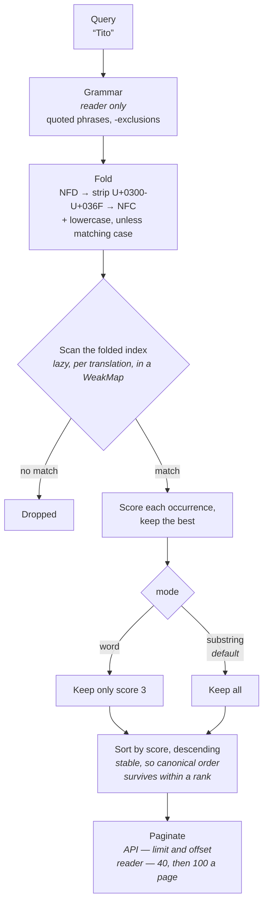
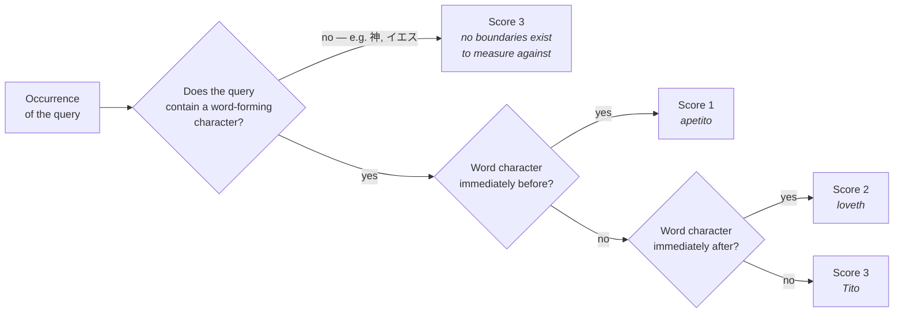
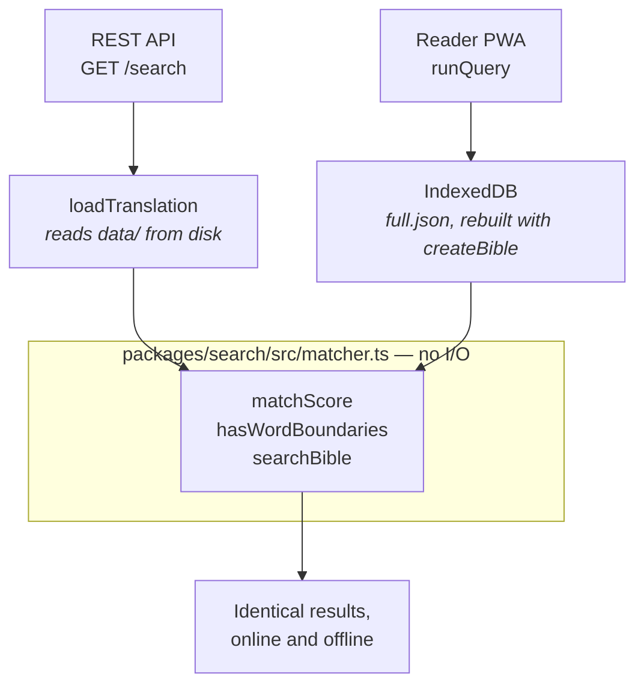

# Scriptura — Architecture Specification

> Open Bible data ecosystem: multi-translation, multi-language, developer-first.
> **License:** Apache 2.0 · **Stack:** TypeScript (primary), Python (data tooling)

---

> **⚠️ This file is a duplicate.** The maintained copy of this specification is
> [`docs/Architecture.md`](docs/Architecture.md); this root copy is kept in sync
> by hand and exists only for backward compatibility. Edit `docs/Architecture.md`
> and mirror the change here, or better, consolidate onto that file and delete
> this one.

## 1. Project goals

- Provide structured, machine-readable Bible data for multiple translations and languages under open licenses
- Expose a consistent TypeScript API developers can use in any runtime (Node, browser, edge)
- Support future study Bible features: side-by-side comparison, cross-reference, and annotation
- Never include a translation that is not verified public domain or an explicit open license

---

## 2. Monorepo layout

```
scriptura/
├── data/                        # Bible text, one directory per translation
│   ├── rv1909/                  # Reina Valera 1909 — Public domain
│   │   ├── metadata.json
│   │   └── books/               # Populated by scripts/ingest.py; committed
│   │       ├── 01-genesis.json
│   │       └── ...
│   ├── kjv/                     # King James Version — Public domain
│   ├── web/                     # World English Bible — Public domain
│   ├── asv/                     # American Standard Version 1901 — Public domain
│   ├── ylt/                     # Young's Literal Translation — Public domain
│   ├── bsb/                     # Berean Standard Bible — Public domain (2023)
│   ├── vbl/                     # Versión Biblia Libre (Spanish) — CC BY-SA 4.0
│   ├── lsg1910/                 # Louis Segond 1910 (French) — Public domain
│   ├── ostervald/               # Bible Ostervald 1867 (French) — Public domain
│   ├── bungo/                   # 文語訳 (Japanese Classical) — Public domain
│   └── martin1744/              # Bible Martin 1744 (French) — Public domain
├── packages/
│   ├── core/                    # Loader, parser, canonical types
│   ├── search/                  # Full-text + reference search
│   ├── compare/                 # Multi-translation diff engine
│   ├── validate/                # Data integrity checks
│   └── api/                     # REST handlers (GraphQL planned — see §5)
│
├── apps/
│   └── reader/                  # Local-first reading and notes PWA (Vite + React);
│                                #   touch and WCAG 2.2 AAA — see §4, "The reader PWA"
│
├── scripts/
│   ├── ingest.py                # Download & normalize source data
│   ├── validate.py              # Run integrity checks on all translations
│   ├── check-canon-sync.py      # Verify the three canon definitions agree
│   ├── build-static-api.mjs     # Compile data/ → dist/ static JSON API tree
│   └── schema-gen.ts            # Generate TypeScript types from JSON schema
│
├── examples/
│   ├── react-app/               # CRA / Vite SPA using @scriptura/core
│   ├── node-server/             # Express REST server using @scriptura/api
│   ├── python-client/           # Python wrapper calling the REST API
│   └── cli-demo/                # Node CLI using @scriptura/search
│
├── tests/
│   ├── unit/                    # jest: packages, contrast tokens, preferences, gestures
│   ├── integration/             # jest: router, static/dynamic parity
│   ├── contract/                # Playwright, API mode: HTTP contract
│   ├── reader/                  # Playwright: the reader in Desktop Chrome
│   ├── reader-touch/            # Playwright: the reader on an emulated phone
│   ├── reader-dev/              # Playwright: the reader's dev server boots
│   ├── helpers/                 # Shared axe, contrast and target-size helpers
│   └── fixtures/                # Sample verse data for test assertions
│
├── docs/
│   ├── Architecture.md          # This document (the maintained copy)
│   ├── API.md
│   ├── usage-examples.md
│   ├── contributing.md
│   ├── translations-status.md   # Tracks license verification for each version
│   └── plans/
│       └── reader-touch-and-aaa/  # Plan, WCAG 2.2 matrix, delegation protocol, briefs
│
├── .github/
│   ├── dependabot.yml           # Weekly npm + github-actions version updates
│   └── workflows/
│       ├── ci.yml               # Validate data + type-check + test (push/PR)
│       ├── codeql.yml           # CodeQL static analysis (push/PR + weekly)
│       └── deploy.yml           # ⚠️ NOT WRITTEN — specified in §8
│
├── dist/                        # Generated static API tree (gitignored)
├── .cache/                      # Ingest download cache (gitignored)
├── CLAUDE.md                    # Guidance for Claude Code (the authority)
├── AGENTS.md                    # Short rules for any automated contributor
├── .claude/agents/              # reader-a11y-lead: the Opus lead for the reader plan
├── .nvmrc                       # Node 24 (Active LTS)
├── tsconfig.json                # Solution file: references only, no options
├── tsconfig.dev.json            # tsx only: maps @scriptura/* at package sources
├── tsconfig.test.json           # ts-jest only: composite off, node10 resolution
├── scriptura-architecture-spec.md   # Duplicate of docs/Architecture.md;
│                                    #   consolidate onto docs/ and delete
├── package.json                 # Workspace root (npm workspaces)
├── tsconfig.base.json
└── LICENSE                      # Apache 2.0
```

---

## 3. Canonical data schema

Every translation stored in `data/` must conform to this structure.

### `metadata.json`
```json
{
  "id": "rv1909",
  "name": "Reina Valera 1909",
  "language": "es",
  "license": "public-domain",
  "attribution": "Reina Valera 1909 — Public Domain",
  "source_url": "https://ebible.org/find/details.php?id=spaRV1909",
  "year": 1909,
  "testament": "both",
  "book_count": 66
}
```

### `books/NN-bookname.json`
```json
{
  "number": 1,
  "name": "Génesis",
  "abbreviation": "Gén",
  "testament": "OT",
  "chapters": [
    {
      "number": 1,
      "verses": [
        { "number": 1, "text": "En el principio creó Dios los cielos y la tierra." },
        { "number": 2, "text": "..." }
      ]
    }
  ]
}
```

The filename prefix (`43-john.json`) encodes the canonical book number and an English slug (`john`). The slug is language-independent and becomes the `:book` URL segment even for non-English translations; `name` inside the file is localized.

### License values (enum)
| Value | Meaning |
|---|---|
| `public-domain` | No restrictions anywhere |
| `cc-by-sa-4.0` | Attribution + ShareAlike required |
| `cc0` | Explicit public domain dedication |
| `custom-free` | Free with conditions (e.g. RVG — no modification, no sale) |

---

## 4. TypeScript package API

All packages are scoped under `@scriptura/*` and published independently.

### `@scriptura/core`

```typescript
// Load a translation
const bible = await loadTranslation('rv1909');

// Access a verse
const verse = bible.verse('John', 3, 16);
// => { number: 16, text: 'Porque de tal manera amó Dios...' }

// Access a chapter
const chapter = bible.chapter('Genesis', 1);

// List all available translations
const translations = await listTranslations();
// => [{ id: 'rv1909', name: 'Reina Valera 1909', language: 'es', ... }]
```

### `@scriptura/search`

```typescript
// Full-text search within one translation
const results = await search('rv1909', 'amor eterno');

// Whole words only, when a name is the point and near-misses are not
const titus = await search('rv1909', 'Tito', { mode: 'word' });

// Reference lookup (supports ranges)
const passage = await lookup('kjv', 'Romans 8:28-39');

// Cross-reference lookup (future)
const refs = await crossRefs('John 3:16');
```

#### How search works

Matching is a **substring** match on **diacritic-folded** text, **ranked by
match quality**. Every stage below runs in `packages/search/src/matcher.ts`,
which has no I/O — so the REST API and the offline PWA run the same code over
the same rules rather than two implementations that drift.



**Folding is normalization, not fuzziness.** `amo` finds `amó` and `amó` finds
`amo` — they are the same word, and treating them as different once hid about a
third of the Spanish and French corpus. There is no edit distance and no
approximate matching, and none is planned. Only **case** is optional
(`caseSensitive`); diacritics are always folded.

⚠️ The strip range is the Latin combining block **only** (`U+0300–U+036F`). A
general `\p{M}` strip also removes the Japanese dakuten (`U+3099`), silently
turning ガラテヤ into カラテヤ — a different word.

#### Ranking

Substring matching finds `loveth` from `love`, which the KJV needs. The cost is
that it also finds `apetito` from `Tito`. Ranking resolves both: nothing is
hidden, but the good matches come first.

| `score` | meaning | example |
|---|---|---|
| **3** | the query is a whole word | `Tito` in *á Tito mi hermano* |
| **2** | a word begins with the query | `love` in *loveth* |
| **1** | the query sits inside a word | `Tito` in *apetito* |



Measured over the real corpus, the tiers separate cleanly:

```
kjv "love":     whole 281   word-start 161   interior 104
   whole:  love, loved, loveth        ← wanted
   starts: lovely, lover, loveth      ← wanted, the archaic inflections
   interior: cloven, clovenfooted     ← unrelated, sinks to the bottom

rv1909 "Tito":  whole 14    word-start 0     interior 3
   whole:  Tito                       ← the person
   interior: apetito, empréstito      ← coincidence, sinks
```

#### Matching modes

`mode: 'word'` keeps only score-3 matches. It is **opt-in, never the default**,
because whole-word matching is expensive in inflected languages:

| translation | query | substring | whole word | |
|---|---|---|---|---|
| `kjv` | love | 546 | 281 | **−49%** — loses *loveth*, *loved* |
| `kjv` | faith | 338 | 231 | −32% |
| `rv1909` | amor | 356 | 160 | **−55%** — loses *amores*, *amoroso* |
| `rv1909` | Tito | 17 | 14 | −18% — the intended effect |
| `kjv` | Abraham | 230 | 230 | unchanged — proper nouns are whole words |

That last row is why there is **no index of biblical people, and none is
planned**. A name is exactly the kind of word that is always whole, so ranking
already answers "find this character" — without a new dataset keyed across 11
translations in 4 languages, and without a fourth definition to keep in sync.

#### ⚠️ Scripts without word separators

Japanese is written without spaces. Treating its characters as word-forming
makes *every* match an interior one, and `mode: 'word'` becomes a wipeout rather
than a filter:

| translation | query | substring | naïve whole word | with the rule below |
|---|---|---|---|---|
| `bungo` | 神 | 3,945 | **3** | 3,945 |
| `bungo` | イエス | 1,411 | **53** | 1,411 |

Two rules together make word mode an exact no-op there rather than an
approximate one:

1. **Han, Hiragana and Katakana are not word characters.** Each CJK character is
   its own word, which is the convention search engines use.
2. **`hasWordBoundaries()` decides per query, not per occurrence.** A query with
   no word-forming character has nothing to measure against, so every match
   scores 3 and word mode returns exactly what substring mode does.

Rule 1 alone was not enough — it still quietly dropped 52 of 3,945 matches for
神. The integration suite asserts *equality*, not similarity, for 神, イエス and
ヨハネ.

#### Where it runs



The reader adds only the **grammar** on top — quoted phrases and `-exclusions` —
and scores every term through the same `matchScore`. A result keeps its *worst*
term's score, so "every word matched cleanly" ranks above "one of them landed
inside a longer word". Exclusions stay substring even in word mode: asking to
drop `love` should drop `loveth` too.

The index is built lazily per translation into a `WeakMap` keyed by the `Bible`,
so translations that are only read never pay the ~23ms and the roughly doubled
text memory. A case-sensitive search builds a second index the same way, only if
one is ever asked for.

### `@scriptura/compare`

```typescript
// Compare a single verse across multiple translations
const diff = await compareVerse('John 3:16', ['rv1909', 'kjv', 'web']);
/*
[
  { translation: 'rv1909', text: 'Porque de tal manera amó Dios...' },
  { translation: 'kjv',    text: 'For God so loved the world...' },
  { translation: 'web',    text: 'For God so loved the world...' }
]
*/

// Compare a chapter across translations (study Bible foundation)
const chapterDiff = await compareChapter('John', 3, ['rv1909', 'kjv']);
```

### `@scriptura/validate`

```typescript
// Validate a single translation directory
await validate('data/rv1909');
// Throws with details if any book/chapter/verse is missing or malformed

// Validate all translations
await validateAll('data/');
```

### The reader PWA (`apps/reader`): touch and accessibility

The reader is the local-first reading and note-taking app built on these packages. It imports only their pure subpaths (`@scriptura/core/bible`, `@scriptura/core/types`, `@scriptura/search/matcher`, `@scriptura/compare/chapters`), so it rebuilds a `Bible` in the browser with the server's own resolution and search rules, reading from IndexedDB. What follows is how it is made usable with a finger on a phone and conformant with **WCAG 2.2 Level AAA** for its own interface. The programme that did this — plan, criterion-by-criterion matrix, and the work packages handed to other agents — is in [`docs/plans/reader-touch-and-aaa/`](docs/plans/reader-touch-and-aaa/README.md).

**Scope of the claim.** AAA applies to the application: its controls, its own text, its colours, its behaviour. Scripture and the reader's own notes are content the app presents rather than authors, so 3.1.5 Reading Level and 3.1.6 Pronunciation are exempt for them; language of parts, contrast, spacing and reflow are enforced on them regardless. Real-device checks (iOS Safari's keyboard, VoiceOver, TalkBack, Windows High Contrast) cannot run in CI and are tracked as open manual checks.

| Concern | Where | What it does |
|---|---|---|
| Display preferences | `src/lib/prefs.ts`, inline script in `index.html` | Theme (light, dark, two high-contrast, sepia, or the device's), text size 100–200 %, spacing presets that meet 1.4.8, column width ≤ 70 ch, reduced motion, non-colour markers. Device-scoped in `localStorage`; applied before first paint; `system` is an *absent* attribute so `prefers-*` stay the defaults. |
| Colour tokens | `src/styles.css` `@tokens` blocks | `light-dark()` pairs for every token, five themes, `--edge` for control boundaries and `--rule` for decoration only. `tests/unit/contrast.test.ts` parses the blocks and checks 135 pairs: 7:1 for text, 3:1 for edges, focus rings and highlight rules. |
| Focus | `src/lib/focus.ts` | `useReturnFocus` gives focus back when a surface closes; `useDismissable` is one stack — Escape closes only the newest surface, an outside press closes it; `useRovingTabIndex` makes the verse actions and the formatting toolbar one Tab stop with arrows. The proposal preview is a native `<dialog>`. |
| Viewport and gestures | `src/lib/viewport.ts`, `src/lib/geometry.ts` | `--vvh`/`--vv-top` publish the visual viewport, so the notes sheet and search suggestions stay above a software keyboard. One pointer-drag helper captures the pointer and treats `pointercancel` as release. Sheet snapping, zoom anchoring and pinch are pure functions with unit tests. |
| Status | `src/lib/announce.tsx` | One polite and one assertive live region, mounted beside the app, for search totals, download progress and errors, panel changes, removals and undo, and every insertion into a note or onto a board — which is also shown, with a checkmark and the same words, where it went or where that is reached from, until the next action. |
| Targets | `--control-h: 44px` | Every pointer target is at least 44 × 44 CSS px (2.5.5), with the verse number (inline in text) and links inside prose as the criterion's exceptions. |
| Updates | `src/components/UpdateNotice.tsx`, `src/lib/pending.ts` | A new service worker waits for the reader's Reload, which first writes note edits still inside the autosave delay. |

**What the reader can do without a mouse, and without dragging.** Every function is keyboard-operable (2.1.3) and every drag has a single-pointer alternative (2.5.7): the pane divider has Narrower/Wider buttons, the notes sheet's grip is a button, a board card has Move/Size and Colour panels of plain buttons, and the board view has pan buttons. On a phone the notes sheet drags and snaps, focusing the note makes it full, the text it covers is `inert`, the verse actions dock above it, and a comparison reads as a list of verses instead of a sideways-scrolling table.

**How it is proved.** Jest owns the arithmetic (contrast pairs, preference parsing, sheet snapping, zoom and pinch). Playwright owns behaviour in a real browser, in three projects against the production build and the dev server:

| Project | Device | Gates |
|---|---|---|
| `reader` | Desktop Chrome | axe-core at the WCAG 2.0–2.2 A/AA/AAA tags in twelve states and both colour schemes, with a self-check that the two AAA rules really ran; 44 px targets in thirteen states; keyboard traversal, focus visibility and focus return; reduced motion; a real service-worker update served from a private origin |
| `reader-touch` | Pixel 7 (Chromium, touch, coarse pointer) | axe and 44 px targets in eleven phone states; reflow at 320 CSS px (1.4.10) and the text-spacing override (1.4.12), each with a planted-failure self-check; touch drags and pinches sent as real touch events through the DevTools protocol, since `page.touchscreen` can only tap |
| `reader-dev` | Desktop Chrome, dev server | The app boots clean when modules are served unbundled |

---

## 5. API layer (`packages/api`)

The API package exposes framework-agnostic REST handlers that drop into any Node server or edge runtime. `createRouter(req)` returns `{ status, body }` and does no I/O of its own.

> **Implementation status.** Every REST route below is implemented and tested. GraphQL is **not implemented** — there is no schema, resolver, or dependency in the package; the sketch below is a design target for v1.1.

### REST endpoints

| Method | Path | Description | Status |
|---|---|---|---|
| `GET` | `/` | Index of endpoints with working examples | ✅ |
| `GET` | `/translations` | List all available translations | ✅ |
| `GET` | `/translations/:id` | Metadata for one translation | ✅ |
| `GET` | `/translations/:id/:book/:chapter` | Full chapter as JSON | ✅ |
| `GET` | `/translations/:id/:book/:chapter/:verse` | Single verse | ✅ |
| `GET` | `/translations/:id/:book` | Book index: chapter numbers + verse counts | ✅ |
| `GET` | `/search?q=&translation=&limit=&offset=&mode=&match_case=` | Full-text search, ranked and paginated | ✅ |
| `GET` | `/compare?ref=&translations=` | Cross-translation verse comparison | ✅ |

> These routes are served **dynamically** by `createRouter` (Express/Fastify/edge). The metadata/book/chapter/verse routes are **also** pre-rendered as static `.json` files for CDN hosting — see §8, and their bodies are **identical** between the two paths. `/search` and `/compare` are dynamic-only.

### Book addressing

The `:book` segment is the English slug from the filename (`43-john.json` → `john`) and is language-independent — `john` addresses that book in `bungo` too. Localized name, abbreviation and canonical book number also resolve, with case, accents and separators folded, so `/translations/rv1909/{john,Juan,Jhn,43,Génesis…}` all work.

Resolution derives entirely from filenames, so it needs **no book table and adds no fourth canon definition** (see §7). Implemented in `packages/core/src/books.ts`.

### Response shapes are a contract

The bodies below are byte-identical to what `scripts/build-static-api.mjs` writes into the static tree, so a client can point at a local server or the CDN unchanged. The builder is zero-dependency `.mjs` that runs without a TypeScript build and therefore cannot import `packages/api/src/format.ts`; `tests/integration/static-parity.test.ts` diffs the two implementations instead. **Change a shape in one and you must change it in the other.**

### GraphQL schema (excerpt) — ⏳ planned, not implemented

```graphql
type Query {
  translations: [Translation!]!
  translation(id: ID!): Translation
  verse(translation: ID!, book: String!, chapter: Int!, verse: Int!): Verse
  search(translation: ID!, query: String!): [SearchResult!]!
  compare(ref: String!, translations: [ID!]!): [TranslationVerse!]!
}

type Translation {
  id: ID!
  name: String!
  language: String!
  license: String!
  books: [Book!]!
}

type Verse {
  number: Int!
  text: String!
  chapter: Chapter!
}
```

---

## 6. Validated open-source translations

| ID | Name | Language | License | Source | Parser | Ingested |
|---|---|---|---|---|---|---|
| `kjv` | King James Version | English | Public domain | [aruljohn/Bible-kjv](https://github.com/aruljohn/Bible-kjv) | `aruljohn` | ✅ |
| `web` | World English Bible | English | Public domain | [eBible `engwebp`](https://ebible.org/find/details.php?id=engwebp) | `usfx` | ✅ |
| `asv` | American Standard Version (1901) | English | Public domain | [eBible `eng-asv`](https://ebible.org/eng-asv/) | `usfx` | ✅ |
| `ylt` | Young's Literal Translation | English | Public domain | [eBible `engylt`](https://ebible.org/engylt/) | `usfx` | ✅ |
| `bsb` | Berean Standard Bible | English | Public domain (2023) | [eBible `engbsb`](https://ebible.org/engbsb/) | `usfx` | ✅ |
| `rv1909` | Reina Valera 1909 | Spanish | Public domain | [eBible `spaRV1909`](https://ebible.org/find/details.php?id=spaRV1909) | `usfx` | ✅ |
| `vbl` | Versión Biblia Libre | Spanish | CC BY-SA 4.0 | [eBible `spavbl`](https://ebible.org/find/details.php?id=spavbl) | `usfx` | ✅ |
| `lsg1910` | Louis Segond 1910 | French | Public domain | [eBible `fraLSG`](https://ebible.org/fraLSG/) | `usfx` | ✅ |
| `ostervald` | Bible Ostervald (1867) | French | Public domain | [eBible `fra_fob`](https://ebible.org/fra_fob/) | `usfx` | ✅ |
| `bungo` | 文語訳聖書 (Classical) | Japanese | Public domain | [CrossWire `JapBungo`](https://www.crosswire.org/sword/modules/ModInfo.jsp?modName=JapBungo) | `sword` | ✅ |
| `martin1744` | Bible Martin 1744 | French | Public domain | [CrossWire `FreBDM1744`](https://www.crosswire.org/sword/modules/ModInfo.jsp?modName=FreBDM1744) | `sword` | ✅ |

All eleven translations carry the full 66-book Protestant canon and pass
`scripts/validate.py --strict` with zero errors and zero warnings.

A translation with no data has **no `data/` directory at all** — an empty
`books/` is a validation error, so the directory is created by the first
successful ingest rather than ahead of it.

eBible IDs are easy to guess wrong (`engasv` 404s; the real id is `eng-asv`).
Confirm any new id against [eBible's index](https://ebible.org/Scriptures/translations.csv)
before adding a registry entry.

> ⚠️ **Never add RV1960** — copyrighted by Sociedades Bíblicas Unidas.
> ⚠️ **Never add 口語訳 (Kougo, 1954/55)** — under US copyright until 2049–2050 via URAA restoration.
>
> The Kougo trap: Japan Bible Society now states its copyright has expired, which is true **in Japan** (50-year term, lapsed ~2004/2005). Because it was still protected there on 1996-01-01, the URAA restored its **US** copyright for 95 years from publication. Japan-PD does not imply US-PD. By contrast the 文語訳 text we do ship — 明治元訳 OT (1887), 大正改訳 NT (1917) — is US public domain, because even a restored term caps at 95 years from publication (1982 and 2012).
>
> `scripts/validate.py` enforces both: it fails the build if a data directory matches a forbidden id or if metadata contains a forbidden marker.

### Ingestion pipeline (`scripts/ingest.py`)

Dependency-free Python (standard library only). A `TRANSLATIONS` registry maps
each id to its licence metadata plus how to fetch it, and three parsers
normalize wildly different upstream formats into the one schema in §3:

| Parser | Source shape | Notes |
|---|---|---|
| `usfx` | USFX XML inside an eBible.org `_usfx.zip` | Milestone verse/chapter model; strips footnotes and cross-references, keeps translator additions. Covers eight translations from one consistent source. |
| `aruljohn` | Per-book JSON from aruljohn/Bible-kjv | Used only by `kjv`. |
| `sword` | A CrossWire SWORD **zText** module | Compiled OSIS in a binary format. Used by `bungo` and `martin1744`. |

Downloads cache under `.cache/` (gitignored); normalized output in `data/` is
committed, because that structured data *is* the product.

**On the `sword` parser.** zText is not plain XML. Each testament is three
files: `.bzs` (block index — offset, compressed size, uncompressed size per
block), `.bzz` (the zlib blocks), and `.bzv` (verse index — block, start, size
per verse). `osis2mod` strips `<verse>` milestones when it compiles a module,
so verse boundaries survive only in `.bzv`. Book and chapter structure is
recovered from the `<div type="book">` and `<chapter osisID>` markers, which get
their own index entries — that is what lets the parser work without carrying a
versification table. Zero-size entries are verses the translation omits; they
still advance the verse counter so neighbours keep canonical numbers.

> ⚠️ `.bzv` offsets are **byte** offsets into the decompressed block. Slice the
> bytes and decode afterwards. Slicing decoded text works fine on ASCII and
> silently corrupts every multi-byte verse — which is the entire point of the
> parser's only current consumer.

zText modules carry no per-book localized headers, so `bungo` book names come
from `JA_BOOK_NAMES`, sourced from SWORD's `ja-utf8.conf`. These are modern-era
names on a classical text; they identify each book correctly, which is the job
of that field.

---

## 7. CI / validation pipeline

Runs on push and pull request to `main` and `develop`.

```
on: push / pull_request  (.github/workflows/ci.yml)
├── validate all translations (scripts/validate.py)
├── canon sync check (scripts/check-canon-sync.py)
│     ├── check every expected book is present (testament-aware)
│     ├── check chapter counts against canon (warning; versification-aware)
│     ├── flag any verse with empty text
│     └── license audit (metadata.json license field per data/ dir)
├── TypeScript type-check (npm run lint → tsc --build, on Node 24 per .nvmrc)
├── Unit tests (jest)
└── Integration tests (API endpoint smoke tests — tests/integration/ is a placeholder)
```

Two jobs, deliberately separate so a data problem and a code problem are
visibly different failures. A third workflow, `codeql.yml`, runs static analysis
on the same triggers plus weekly. Node comes from `node-version-file: .nvmrc`, so the
version lives in exactly one place. `npm ci` requires a current committed
`package-lock.json` — that is the most likely way to break this workflow.

Note `lint` is `tsc --build`, not `tsc --noEmit`: the packages are composite
project references, and TypeScript rejects `--noEmit` on those (TS6310). The
build *is* the type-check.

In practice: **errors** fail the build (missing books, empty text, bad/missing license, a forbidden translation), while **warnings** do not (chapter-count differences from versification, verse-number gaps in critical-text translations). Deployment runs in a separate workflow — see §8.

### Supply-chain posture

`.github/dependabot.yml` takes weekly npm and github-actions version updates.
Dependabot **security** alerts are a repository setting rather than a file and
must be enabled under Settings → Code security — they were off, which is why the
express 4 / `qs` advisories went unnoticed. Secret scanning and push protection
are on. All of these are free and unlimited because the repository is public.

The canon is defined in three places that must stay in sync:
`packages/validate/src/canon.ts`, `scripts/validate.py`, and `scripts/ingest.py`.

Neither of these is a fourth definition: `JA_BOOK_NAMES` in `ingest.py` is
display metadata keyed off the existing USFM codes, and book addressing in
`packages/core/src/books.ts` derives slugs from filenames. Both define no
numbering, order, or chapter counts.

`scripts/check-canon-sync.py` verifies all three agree with each other and with
the committed data, on every CI run. It covers book numbers, names, testaments,
chapter counts, abbreviations and filename slugs.

That check exists because the manual discipline failed: `canon.ts` used to carry
an `abbreviation` column that was wrong for 45 of its 66 books (OSIS-style
`Exod`/`1Sam`/`1Kgs` where the data has `Exo`/`1Sa`/`1Ki`), and nothing noticed
because `packages/validate/src/index.ts` reads only `number` and `chapters`. The
column is gone; abbreviations live in `ingest.py`, which writes them, and in
each book's JSON, which carries them.

---

## 8. Deployment & hosting — ⚠️ specified, not provisioned

No AWS infrastructure exists yet and `deploy.yml` has not been written. The
static build itself (`npm run build:api`) does work today — it emits ~12,500
JSON files across the ten ingested translations. Everything below the static
build is a design target.

Scriptura serves the same data two ways.

- **Dynamic** — `@scriptura/api`'s `createRouter` runs inside any Node server or edge runtime (see `examples/node-server`). Best when the host can run code.
- **Static** — `scripts/build-static-api.mjs` pre-renders `data/` into a tree of JSON files under `dist/`, one per endpoint, for hosting on object storage + CDN with no running server. This is the primary hosting path.

### Static build (`npm run build:api`)

Writes an endpoint file per route; every file carries a `.json` extension:

```
/translations.json
/translations/:id.json
/translations/:id/:book.json
/translations/:id/:book/:chapter.json
/translations/:id/:book/:chapter/:verse.json     (omit with --skip-verses)
```

The `.json` extension is required because the verse path forces `:chapter` to be a **directory** (it holds the verse files); the chapter itself is served as `:chapter.json`, which coexists with the `:chapter/` directory with no conflict. (An optional CloudFront Function can later strip the extension for cleaner URLs without changing the file tree.)

Per-verse files produce a very large object count (~31k per full translation); `--skip-verses` yields a leaner build where verses remain reachable via the chapter endpoint.

### AWS target (S3 + CloudFront)

- Private S3 bucket, served only through CloudFront via **Origin Access Control (OAC)** — not the S3 website endpoint.
- **CORS** added through a CloudFront response-headers policy (not the bucket).
- Objects synced with `Cache-Control: max-age=31536000, immutable` — Bible text never changes, so it caches indefinitely; each deploy invalidates `/*`.
- Custom-domain TLS certificate must live in **`us-east-1`** (CloudFront requirement), regardless of the bucket's region.
- GitHub Actions (`deploy.yml`) authenticates via **GitHub OIDC** (no static keys) and runs on push to `main`: build → `aws s3 sync` → CloudFront invalidation.

### Dynamic endpoints (Phase 2)

`/search` and `/compare` can't be pre-rendered. They run as an AWS Lambda (Function URL) added as a **second CloudFront origin** with `/search*` and `/compare*` path behaviors, sharing the same domain as the static tree.

---

## 9. Study Bible roadmap (future phases)

| Phase | Feature |
|---|---|
| v1 | Core loader + search + REST API + translation data ✅ (all 11 ingested) |
| v1.1 | GraphQL layer + additional translations |
| v2 | `compare` package — side-by-side diff for study Bible UI ✅ |
| v2.1 | Cross-reference data (Open Scriptures) |
| v3 | Annotation layer — personal notes, highlights per verse ✅ (local, in the reader) |
| v3.1 | Commentary integration (public domain commentaries via CCEL) |
| v4 | Study Bible UI (React) consuming all packages ✅ (`apps/reader`, five stages) |
| v4.1 | Reader usable by touch and conformant with WCAG 2.2 AAA ✅ — real-device and screen-reader checks ⏳ planned ([plan](docs/plans/reader-touch-and-aaa/README.md)) |

---

## 10. Contributing guidelines (summary)

- All Bible data additions **must** include a verified `license` field in `metadata.json`
- PRs adding a new translation must link to the primary source confirming the license
- No translation may be added without independent copyright verification
- The `scripts/validate.py` check must pass on any new data directory before merge
- All TypeScript packages must maintain 100% type coverage (no implicit `any`)